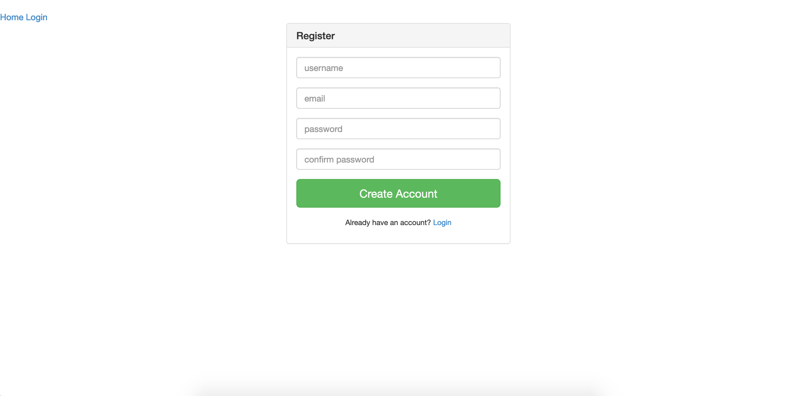
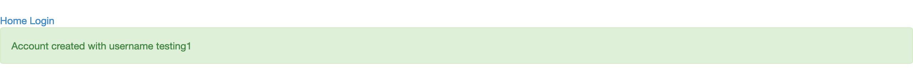
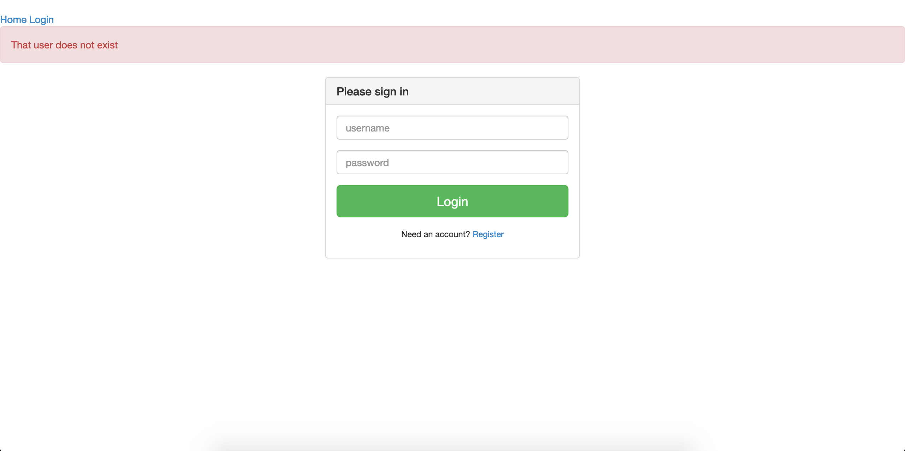
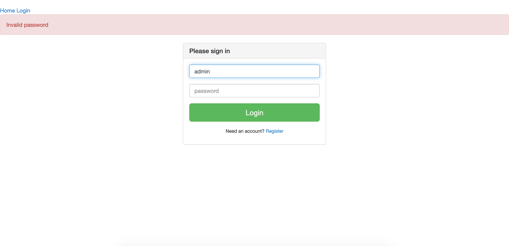
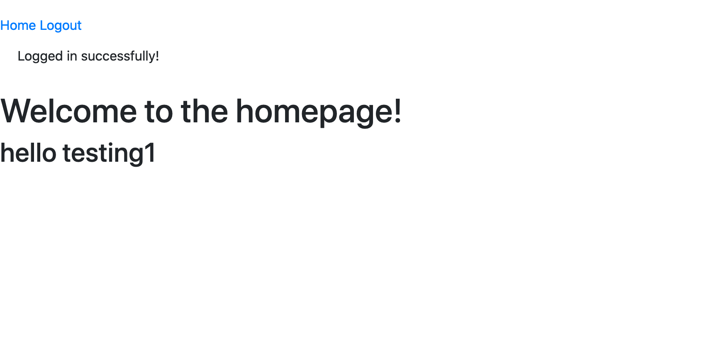
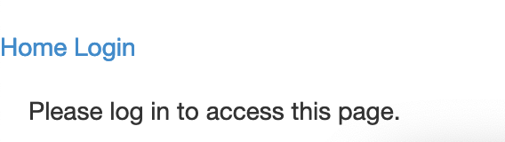

# Flask Login App
A simple login system using the Flask framework. Was built for education purposes to get me familiar with mainly Flask,
but also database ORM, templating engines, etc.

# Frameworks/modules used for this project
- Flask
- Jinja2 templating engine
- SQLAlchemy
- werkzeug for password hashing
- WTForms

# Functions

1. Register

A successful registration will add that user to the database, and display a successful flash message.

2. Log in

Registered users will be able to login. Error messages will be shown if the account does not exist, or the password is incorrect.

3. Homepage

The homepage is available only to logged in users. 

Any attempt to access the homepage while not logged in will redirect to the login page and display a message.

